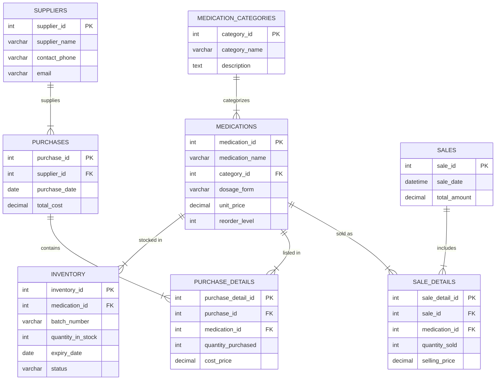

Database Schema

Table Descriptions

 The medication_categories table -
Stores different categories of medications (e.g., Antibiotics, Painkillers).

The medications table -
Stores details of each medication, linked to a category.

The inventory table -
Tracks stock levels, batch numbers, and expiry dates for medications.

The suppliers table -
Information about suppliers who provide medications.

The purchases table -
Records purchase transactions from suppliers.

The purchase_details table -
Line items for each purchase, linking medications to the purchase record.

The sales table -
Records sales transactions to customers.

The sale_details table -
Line items for each sale, detailing which medications were sold.
